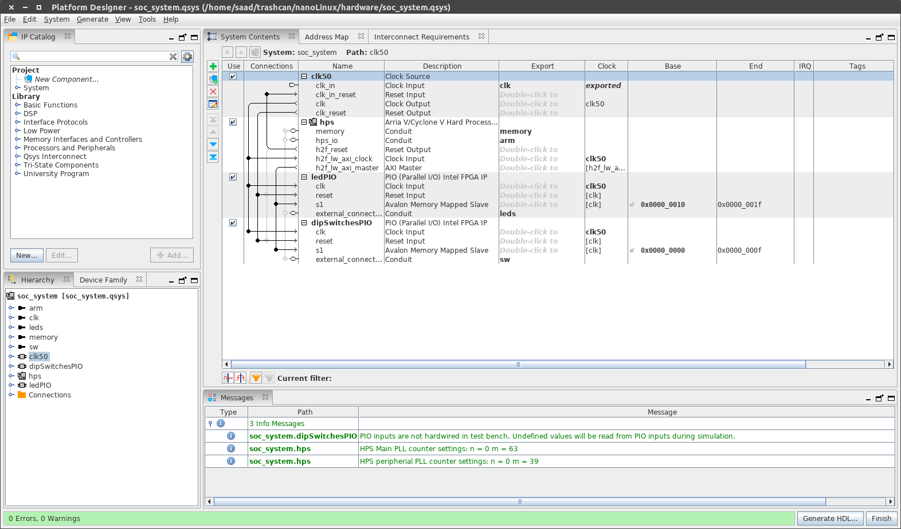
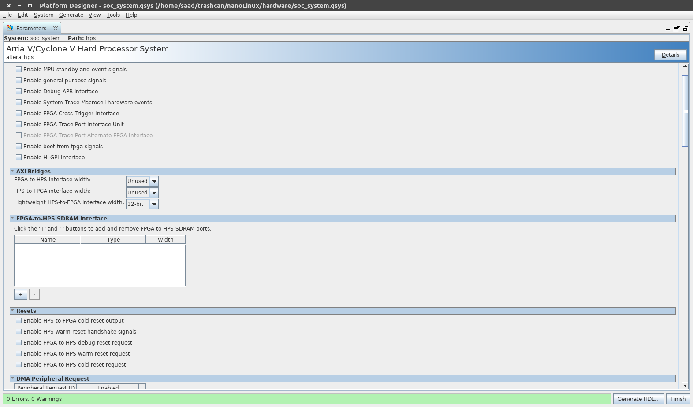

# nanoLinux
A linux builder for the DE10 Nano. It builds the latest uBoot, Linux Kernel and a Ubuntu 20.04 based rootfs to be used on the DE10 Nano. The hardware design is very minimal with the ARM HPS connected only to LEDs and Switches through LWH2F bridge. You can freely modify the hardware design, the scripts will automatically configure uBoot and Device Trees according to Qsys generated design files.

The goal of this repo is to provide an automated environment in which Linux based designs can be made without depending on the GHRD that is provided. To design systems from a 'clean slate' with the latest kernel and bootloader.

Most of the flow is automated. The only step requiring user input is modification of script variables if the arm GNU toolchain is not installed in a standard path.

## PreRequisites
  - Quartus 19 (Older versions **will not work**)
  - SoC EDS 19
  - `arm-linux-gnueabihf` GCC toolchain (`apt install gcc-arm-linux-gnueabihf`)
  - Build Essentials
  - All commands run in Embedded Command Shell
  - ~10 GB disk space that you can allocate (the build takes 8.8 GB)
  - DE10 Nano
  - SDCard (size of card image is 720 MB)
  - `qemu-arm-static` if you want to `chroot`

## Prep
If you did not install in `/usr/bin` then you need to edit the `CROSS_COMPILE` variable in `uboot.sh` and `linux.sh`. To find out where your toolchain is installed run 

```bash 
 which arm-linux-gnueabihf-gcc
```

## Hardware Project
The Quartus project is in `hardware` directory. A script called `compile.sh` will compile the design. It is very minimal. The Qsys for the design is:



There are no FPGA <---> HPS events. Only LWH2F bridge is enabled. All the HPS peripherals are however enabled.



## Usage
  - Create the RTL for your hardware (or use the default)
  - Run the `compile.sh` script in the hardware directory to make `RBF`
  - Run the `uboot.sh` script in top directory to download and build uboot. Also compiles the `u-boot.script` file. This creates a `sdfs` directory which contains the contents for the FAT partition of SDCard (`.rbf`, `u-boot.scr`, `zImage`).
  - Run the `linux.sh` script to download and build the latest kernel and ubuntu based rootfs. Creates a `rootfs` directory which contains the contents of ext3 partition.
  - Finally run `sdimg.sh` to build an SDCard image. Flash it with `dd`
  - Run the Board with the card. The user name is `root` and password is `asad`

  ### Note:
  To customize UBoot/Linux/Buildroot, after they have been downloaded/built, you can stop the script, run `make menuconfig` in the corresponding directories. After customizing, re-run the corresponding `linux/uboot.sh` file.

## Generated Directories
  - `bootloader`: `bsp-editor` generated files
  - `bootloader/uboot`: UBoot sources (from altera-opensource)
  - `kernel/source`: Linux sources (from altera-opensource)
  - `rootfs`: ext3 partition files (uncompressed rootfs)
  - `sdfs`: FAT partition files

## Demo 


`40 MB` rootfs with default settings

## Porting
Porting to other boards should be trivial. 
  - Update the Quartus Project
  - Replace the board `.xml` files in `hardware` directory (Look in the GHRD for these)
  - Change the Uboot config in `uboot.sh` script
  - The rest should remain unchanged

## Tidbits
  - If `apt` doesn't work in chroot with error `Couldn't create temporary file` do:
    
    ```bash
    chmod 1777 /tmp
    ```
  - Install `init` package
  - Then run `ln -s /lib/systemd/system/getty@.service /etc/systemd/system/getty.target.wants/getty@ttyS0.service` to get login prompt on serial port